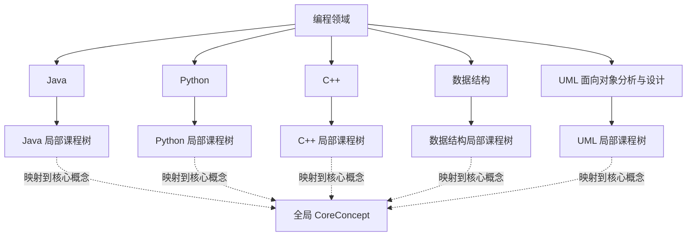
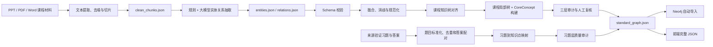

# 智能编程辅导系统：编程领域知识图谱模块完整工作整理

> 文档用途：供最终汇报 PPT 制作人员理解项目全过程、技术方案、关键改进、当前成果和验收状态。本文不是逐页 PPT 大纲，而是对本模块“从最初设想到当前正式版本”的完整说明。

## 一、我们负责的内容是什么

本项目的总体目标是设计并实现一个智能编程辅导系统。我们负责其中的**编程领域知识图谱自动化构建与习题知识点映射模块**，不是单独开发整个辅导系统，也不是只做一个 Neo4j 可视化页面。

本模块需要完成的核心任务包括：

1. 接收课程 PPT、PDF、Word 等不同格式的教学材料。
2. 从材料中提取可教学、可解释、可追溯的编程知识。
3. 构建课程、知识域、知识单元和知识点之间的层级结构。
4. 表达编程语言、语法元素、代码结构、代码示例、算法、能力和错误模式等编程领域特有信息。
5. 对重复实体、同义词、跨语言同名概念和关系方向进行融合、消歧与规范化。
6. 把经过验证的习题、答案、题型、难度和能力要求纳入图谱。
7. 建立“习题考察哪些知识点”的精确映射。
8. 将图谱写入 Neo4j，并生成可直接交给前端使用的完整 `standard_graph.json`。

它在智能编程辅导系统中的作用可以概括为：

> 把分散在课件和习题中的教学信息转化为结构化、可查询、可追溯的知识网络，为知识检索、学习路径分析、题目推荐、薄弱点诊断和前端可视化提供基础数据。

---

## 二、最初的方案：以面向对象编程为例跑通 Demo

项目初期，我们参考了相关论文的 Schema Alignment、Verification 等思想，也分析了已有的 `knowledge_graph_generation.py`。论文和已有代码为我们提供了自动抽取、结构对齐和结果验证方面的启发，但我们没有直接照搬论文实现，而是先用自己的课程材料验证一条完整工程链路。

最初选取“面向对象编程”作为代表性例子，主要原因是：

- 面向对象不是某一种语言独有的内容，Java、Python、C++ 都可以提供实现证据。
- 它同时包含概念、语法、代码结构、代码示例和习题，适合验证编程知识图谱的特色。
- 类、对象、封装、继承、多态、接口等知识天然具有网状关联，不适合只用线性目录表达。

早期 Demo 形成了四个基础阶段：

```text
课程材料预处理
    -> 实体与关系抽取
    -> 实体融合和关系消歧
    -> Neo4j 入库与查询
```

之后又增加第五阶段：

```text
习题标准化 -> 习题到知识点映射 -> 习题层入库
```

这一阶段的主要价值不是形成最终图谱，而是证明从原始教学材料到 Neo4j 的流程能够运行。

---

## 三、第一次汇报后暴露的问题

老师在早期汇报中提出的意见，推动项目从“能运行的 Demo”转向“质量可控的正式系统”。主要问题包括：

1. **实体类型不在同一维度。**
   例如把编程范式、知识概念、语言、语法、代码和能力并列使用，边界不清晰。

2. **关系类型存在重合和泛化。**
   例如早期 `implemented_in` 同时表达“概念受语言支持”“语法属于语言”和“代码使用某语言”，一个关系承担了多种语义。

3. **评估维度没有具体规则。**
   不能只报告节点数和关系数，还需要说明正确性如何判断、错误如何发现、什么数据允许进入正式图谱。

4. **已有代码需要优化和扩展。**
   不能停留在论文或样例代码提供的基础功能上，需要形成适合本项目材料、课程和验收要求的工程流程。

5. **必须体现编程领域特色。**
   如果图中只有普通概念和“属于”关系，它与传统百科知识图谱没有本质区别。

6. **面向对象应理解为跨语言的宏观概念。**
   不能把它限定为 Python 或 Java 的单门课程内容。

7. **编程实体和关系应采用专门的抽取与验证方式。**
   例如识别语法元素、代码示例、类与接口结构、语言支持关系和习题考点，不能完全依赖普通文本实体识别。

8. **输入材料规模较小时就应开始人工复核。**
   越早发现 Schema 和知识树问题，越能避免错误在更多课程中重复出现。

这些意见最终形成了我们的基本原则：

> 大模型负责提高自动化能力，Schema、课程知识树、证据和质量闸门负责控制它不能随意生成什么；不确定数据不直接进入正式图谱。

---

## 四、项目方案的主要演进过程

### 4.1 从 OOP 关键词过滤改为编程领域预处理

早期预处理器只保留与面向对象有关的内容，导致函数、模块、控制结构、输入输出、线程和数据结构等课程内容被过滤掉。这种做法可以用于 OOP Demo，但无法支持完整编程领域图谱。

因此我们将预处理方式改造成“编程领域模式”：

- 支持 `.pptx`、`.ppt`、`.pdf`、`.doc`、`.docx`、`.txt`、`.md` 和结构化 JSON。
- 提取页码、幻灯片位置、来源文件、章节、课程和语言信息。
- 清除页眉页脚、重复标题、乱码、空白页和版式噪声。
- 区分概念解释、语法说明、代码示例、习题等材料角色。
- 将长文本切分为稳定的知识片段，输出统一的 `clean_chunks.json`。
- 每个片段保留来源证据，后续所有节点和关系都能回溯到原课件页码或题目来源。

预处理阶段只负责把不同格式材料转成高质量知识片段，**不在此阶段决定最终实体和关系**。

### 4.2 从平面实体集合改为分层 Schema

针对“实体类型不在同一维度”的问题，我们把实体按用途分层。

#### 课程组织层

- `Course`：课程，如 Java、Python、C++、数据结构、UML 面向对象分析与设计。
- `KnowledgeDomain`：课程中的知识域。
- `KnowledgeUnit`：知识域下的教学单元。
- `KnowledgePoint`：能够独立讲解、练习或测评的具体知识点。
- `CoreConcept`：至少被两门课程材料共同支持的全局核心概念。

#### 编程语言与代码层

- `ProgrammingLanguage`：编程语言。
- `SyntaxElement`：`if`、`for`、`public`、`extends` 等语法元素。
- `CodeStructure`：代码中的类、接口、方法、函数或局部结构。
- `CodeExample`：教学材料中的具体代码片段。

#### 专业教学层

- `Algorithm`：具体算法。
- `AlgorithmStrategy`：算法策略。
- `AlgorithmProblem`：算法问题。
- `OperationRule`：操作步骤或规则。
- `ComplexityMetric`：复杂度指标。
- `Ability`：课程培养的能力。
- `ErrorPattern`：典型错误模式。
- `LibraryFramework`、`TechnologyPlatform`：库、框架和技术平台。

#### 习题层

- `Question`：具体题目。
- `QuestionType`：题型。
- `Difficulty`：难度。
- `QuestionAbility`：解题需要的能力。

这种分层解决了“类、Java、extends、一段代码、一道题为什么会被并列成同一种知识实体”的问题。

### 4.3 从泛化关系改为有头尾类型约束的关系

每种关系都规定允许的起点类型、终点类型和方向。例如：

| 关系内部码 | 中文展示 | 典型含义 |
|---|---|---|
| `part_of` | 属于 | 子知识节点属于父节点，是课程树唯一层级关系 |
| `prerequisite_of` | 前置依赖 | 学习 A 是学习 B 的前置条件 |
| `maps_to_core` | 映射到核心概念 | 课程局部知识点映射到跨课程公共概念 |
| `supported_in_language` | 语言支持 | 某概念可在某语言中实现 |
| `belongs_to_language` | 属于语言 | 某语法元素属于某编程语言 |
| `has_syntax_element` | 具有语法元素 | 知识点关联具体语法形式 |
| `has_code_example` | 具有示例代码 | 知识点或教学节点关联代码示例 |
| `appears_in_example` | 出现于示例 | 局部代码结构出现在哪个代码示例中 |
| `syntax_used_in_example` | 用于示例 | 某语法元素在哪段代码中使用 |
| `inherits_from` | 继承自 | 某局部类结构继承另一类结构 |
| `implements_interface` | 实现接口 | 某局部类结构实现接口结构 |
| `may_cause` | 可能导致 | 某知识或语法可能导致典型错误 |
| `differs_from` | 不同于 | 两个概念或语言事实存在明确差异 |
| `develops_ability` | 培养能力 | 某知识点培养某种能力 |
| `assesses` | 考察 | 某道习题考察某个具体知识点 |

内部继续使用稳定的英文关系码，便于程序校验、去重和查询；对外展示使用中文名称。这样既保证内部处理质量，也满足汇报和前端展示需要。

### 4.4 对别名、同义词和独立知识点重新治理

早期图谱曾把“封装、继承、多态、类、对象、接口”等都放进“面向对象编程”的别名中。这个问题的本质是把关键词召回结果误当成同义词。

我们重新规定：

- `aliases` 只保存缩写、译名和真正同义表达，例如 OOP、面向对象、面向对象程序设计。
- 核心特点和核心概念必须作为独立节点。
- 如果一个词已经是独立知识节点，默认不能同时作为另一个节点的别名。
- 用于文本召回的关键词单独保存，不回写到前端展示别名。

因此最终语义应表达为：

```text
面向对象编程
├─ 别名：OOP、面向对象、面向对象程序设计
├─ 核心特点：封装、继承、多态、抽象
├─ 核心概念：类、对象、接口
└─ 实现机制：构造与析构、方法重写、动态绑定等
```

### 4.5 对代码示例和代码结构进行专项治理

编程知识图谱与普通知识图谱的重要区别之一，是它需要表达真实代码及其局部结构。

我们为 `CodeExample` 制定了严格准入规则：

1. 来源必须被识别为代码示例，而不是概念说明或 API 列表。
2. 文本需要包含足够的代码结构特征。
3. 说明性文字不能明显多于代码内容。
4. 必须至少被一个知识点、语法元素或代码结构关联。
5. `CodeExample` 必须是叶子节点，不允许作为关系发起者。

图谱统一采用以下方向：

```text
知识点 -> 具有示例代码 -> CodeExample
语法元素 -> 用于示例 -> CodeExample
CodeStructure -> 出现于示例 -> CodeExample
```

这样代码示例只作为证据和展示内容，不会反过来破坏课程知识树。

早期 `Main`、`A`、`B`、`g` 等同名代码符号曾被跨课件错误合并。后来我们给 `CodeStructure` 增加示例作用域，身份由语言、来源文件、代码示例和结构类型共同确定，避免把不同程序中的局部变量或类误认为同一个实体。

### 4.6 从全局混合图改为课程中心架构

当 Java、Python、C++、数据结构等课程逐步加入后，我们一度把所有抽取结果直接融合到同一个全局知识树中。这样容易出现两个问题：

- 同名概念被过度合并，失去课程上下文。
- 整图虽然连通，但前端无法清楚看出五门课程各自的结构。

老师进一步提出，最终图谱应当以课程为组织单位，把 Java、Python、C++、数据结构等课程分开，同时保留跨课程公共知识。

因此最终采用“**课程局部树 + 全局核心概念层**”的混合架构：



其关键规则是：

- `part_of` 只允许发生在同一门课程内部，不能跨课程。
- 每个课程局部知识节点必须沿唯一 `part_of` 路径回到本课程根节点。
- 跨课程的相同或等价概念不直接合并身份，而是通过 `maps_to_core` 映射到 `CoreConcept`。
- 自动创建全局核心概念至少需要两门课程的直接材料证据。
- 课程节点保留教学上下文，全局核心节点承担跨课程检索和概念融合。

这解决了“完全分开就没有跨课程联系”和“全部合并就丢失课程边界”之间的矛盾。

### 4.7 最终课程范围的确定

项目曾尝试纳入“算法设计与分析”。在后续汇报中，老师认为它与最终希望展示的课程组合存在一定偏离，因此我们没有继续把它保留在正式交付图谱中，而是替换为更符合面向对象与软件建模主线的 UML 课程。

最终正式图谱包含五门课程：

1. Java
2. Python
3. C++
4. 数据结构
5. UML 面向对象分析与设计

面向对象编程不是第六门课程，而是贯穿 Java、Python、C++ 和 UML 的共享主题及核心概念集合。

---

## 五、最终自动化构建流程

当前正式流程如下：



### 5.1 多源材料预处理

`preprocess_materials.py` 负责把不同格式材料转换为统一知识片段。每个片段保留：

- 唯一 `chunk_id`
- 来源文件与文件类型
- 页码或幻灯片位置
- 课程与编程语言
- 章节、标题和正文
- 材料角色
- 证据位置

输出的 `clean_chunks.json` 是后续所有步骤的统一输入。

### 5.2 规则与大模型协同抽取

`extract_graph.py` 根据 Schema 从片段中抽取实体和关系。

我们没有把大模型当成最终裁判，而是采用以下机制：

- Prompt 中限制实体类型、关系类型和输出 JSON 结构。
- 确定性的语言、语法和代码模式优先由规则处理。
- 语义性较强或存在歧义的片段使用模型辅助。
- 支持千问、DeepSeek、GLM 等兼容模型切换。
- 使用 API 缓存，模型或网络中断后可以继续，不必从头处理全部片段。
- 支持超时、重试、失败记录和小规模 smoke test。
- 模型输出还要经过 Schema 和证据检查，不能直接成为正式图谱事实。

抽取阶段输出：

- `entities.json`
- `relations.json`
- `extraction_report.json`
- `api_cache/`

### 5.3 实体融合、消歧与关系规范化

`normalize_graph.py` 负责把粗抽取结果整理为标准图谱候选，主要处理：

- 同义实体与别名归一。
- 同名异义实体拆分。
- 跨材料重复实体合并。
- 关系方向规范化。
- 反向重复关系删除。
- 关系头尾类型校验。
- 语言事实白名单和黑名单校验。
- 低置信度关系复核。
- 自环、重复边、悬空边过滤。

规范化遵循两个保守原则：

> 宁可少合并，也不要错合并；宁可少保留关系，也不要把不确定关系写入正式图谱。

### 5.4 课程知识树对齐

模型不能自由决定最终教学层级。课程树由人工维护的课程目录和材料证据共同约束。

候选节点只有满足以下条件才进入正式知识树：

- 属于当前五门课程范围。
- 能在输入材料中找到直接证据。
- 能确定其父节点和教学层级。
- 类型符合 Schema。
- 不与现有节点重复或冲突。

证据不足、名称异常、像教材名/教师名/工具名或无法确定层级的内容保留在候选报告中，不会被硬加入正式图谱。

### 5.5 课程中心图谱构建

`build_course_centered_graph.py` 将五门课程的局部知识树组织到“编程领域”根节点下，再根据多课程证据构建全局 `CoreConcept` 层。

这个阶段不需要重新调用大模型，而是复用已经抽取和审核过的节点、关系及页级证据，保证架构调整不会重新引入随机性。

### 5.6 Neo4j 入库与前端交付

`import_to_neo4j.py` 将标准 JSON 转为 Neo4j 属性图：

- 节点使用 `KnowledgeNode + 具体类型标签`。
- 关系内部保留英文码，Neo4j 和前端可使用中文展示名。
- 支持生成 Cypher 脚本，也支持连接本地 Neo4j 自动导入。
- 正式架构切换时使用完整清空和替换，避免旧架构数据残留。
- 导入过程生成节点数、关系数、执行结果和展示查询报告。

完整 JSON 使用临时文件写完后原子替换，避免前端读取到只写了一半的文件。

---

## 六、三层质量控制和人工复核机制

项目中“程序能跑完”不等于“图谱正确”。我们建立了课程树、Schema、证据和人工审核共同组成的质量闭环。

### 6.1 第一层：课程知识树与材料证据

第一层回答的是：**这个节点应不应该进入这门课程，它应该位于哪里？**

主要规则包括：

- 正式知识节点必须有课件、教材或习题证据。
- 每个课程局部节点必须有唯一父级路径。
- 每个节点必须能够沿 `part_of` 回到本课程节点，再回到“编程领域”根节点。
- 课程层级不能出现环。
- 目录外候选不自动入库。

### 6.2 第二层：Schema 与自动规则校验

第二层回答的是：**实体类型、关系类型、方向和事实是否合法？**

主要检查包括：

- 节点 ID 和关系 ID 是否唯一。
- 关系端点是否存在。
- 是否存在自环和重复边。
- 关系头尾类型是否符合 Schema。
- `part_of` 是否跨课程。
- `maps_to_core` 是否只能指向 `CoreConcept`。
- 前置依赖是否形成环。
- 编程语言事实是否正确。
- 别名是否与独立知识点冲突。
- CodeExample 是否真的是代码、是否为叶子、是否存在主归属。
- CodeStructure 是否具有局部作用域。

### 6.3 第三层：人工语义复核

第三层回答的是：**结构合法的事实在教学语义上是否真的正确？**

人工复核重点包括：

- 易混淆关系和前置依赖是否合理。
- 候选知识点应该新增、合并、补别名、仅补关系还是暂不纳入。
- 跨课程概念是否确实可以映射到同一个核心概念。
- 代码片段是否被误分类为代码示例。
- 习题答案是否与原题一一对应。
- 习题考点是否真正决定解题，而不是只在题干或干扰选项中出现。

发现问题后，我们优先修改 Schema、课程目录、抽取规则或映射规则，再重新生成图谱，而不是只手工修改最终 JSON。这样相同错误在下一次运行时不会再次出现。

### 6.4 自动“三轮审计”和项目“三层复核”的区别

代码中的课程中心自动审计具体检查：

1. 课程树唯一父路径。
2. Schema 端点与课程边界。
3. 核心概念映射是否具有至少两门课程证据。

在项目管理口径中，通常把课程知识树、Schema 自动校验和人工语义复核称为“三层复核”。两者并不矛盾：自动审计负责可重复检查，人工审核负责自动规则无法完全判断的教学语义。

---

## 七、习题层是如何构建的

### 7.1 从 Demo 习题到正式来源验证题库

早期使用 20 道带人工知识点标注的样例题验证流程。它们帮助我们发现：单纯使用题干关键词或让模型自由映射，会把语言名、代码中顺带出现的语法、甚至干扰选项错误地当作考点。

正式阶段改为处理带来源证据的真实试题，并规定：

- 题干必须完整。
- 答案必须与题号、题干、来源文件和页码严格绑定。
- 同一来源中的重复题要合并，但保留所有来源记录。
- 没有答案、答案不完整或无法确认对应关系的题目保留为候选。
- 不使用模型猜测缺失的正式答案。
- 映射必须使用当前五课程图谱中真实存在的节点 ID。

### 7.2 习题答案配对

对于有标准答案的材料，系统按照来源文件、题型分区、题号和答案键进行配对。复杂 PDF 还会保留题干证据和答案证据，必要时进行页面视觉复核。

一道题只有同时满足“题干完整、答案完整、来源可验证、配对关系明确”才允许进入正式候选题库。

### 7.3 习题到知识点映射

每道题映射到一个或多个具体 `KnowledgePoint`：

- `primary`：不掌握就无法完成该题的核心知识点。
- `secondary`：确实参与推理的辅助知识点。
- 题目语言只作为属性，不自动视为考点。
- 代码中出现某语法，不代表题目一定考察该语法。
- 干扰选项中的知识点默认不进入正式映射。
- 映射数量受控，避免一题连接大量泛化节点。

题目还会连接：

- `has_type`：题型。
- `has_difficulty`：难度。
- `requires_ability`：所需能力。
- `assesses`：考察的知识点。

### 7.4 当前正式习题成果

统一来源验证阶段共整理出 49 道不重复题目：

- C++ 35 道。
- Java 14 道。
- 合并 5 道重复来源题，保留多来源证据。
- 47 道具有可信映射候选。
- 其中 2 道主映射粒度过宽，另有 2 道缺少足够精确知识点。
- 最终只将 45 道题及其精确 `KnowledgePoint` 映射纳入正式完整图谱。

正式习题层当前包含：

| 内容 | 数量 |
|---|---:|
| Question 节点 | 45 |
| “考察”关系 | 73 |
| “题型”关系 | 45 |
| “具有难度”关系 | 45 |
| “需要能力”关系 | 58 |

当前 45 道正式题均满足：

- 题目 ID 唯一。
- 答案非空且来源可验证。
- 至少有一条精确考点映射。
- 不引用失效知识点 ID。
- 不存在孤立题目。

---

## 八、当前最终成果

### 8.1 五课程知识图谱

正式课程图谱文件：

```text
work/oop_kg_demo/output/programming_kg/course_centered_v12_candidate_finalized/standard_graph.json
```

核心统计：

| 指标 | 当前结果 |
|---|---:|
| 正式知识节点 | 2560 |
| 正式知识关系 | 5853 |
| 正式课程 | 5 |
| 最大层级深度 | 7 |
| 全局 CoreConcept | 71 |
| 课程到核心概念映射 | 228 |
| KnowledgeDomain | 47 |
| KnowledgeUnit | 121 |
| KnowledgePoint | 335 |
| CodeExample | 731 |
| CodeStructure | 1054 |
| SyntaxElement | 103 |

五门课程局部节点规模：

| 课程 | 课程局部节点 | KnowledgePoint | CodeExample |
|---|---:|---:|---:|
| Java | 469 | 61 | 104 |
| Python | 57 | 20 | 2 |
| C++ | 1086 | 74 | 319 |
| 数据结构 | 545 | 73 | 261 |
| UML 面向对象分析与设计 | 331 | 107 | 45 |

不同课程规模差异来自输入材料数量、课件形式和代码密度，不代表课程重要程度排序。

### 8.2 包含习题的完整交付图谱

前端和整体交付使用：

```text
work/oop_kg_demo/output/programming_kg/course_centered_v12_with_questions/standard_graph.json
```

完整统计：

| 指标 | 当前结果 |
|---|---:|
| 总节点数 | 2618 |
| 总关系数 | 6074 |
| 课程知识节点 | 2560 |
| Question | 45 |
| 新增习题及元数据节点 | 58 |
| 新增习题层关系 | 221 |

该 JSON 与当前 Neo4j 中的总节点数和总关系数一致。

### 8.3 当前自动质量审计结果

正式课程图谱已经通过以下检查：

- 节点 ID 唯一。
- 关系 ID 唯一。
- 无悬空边。
- 无自环。
- 无重复边。
- 正式 Schema 合法。
- 2560 个课程知识节点全部连接到课程体系根节点。
- 无孤立知识节点。
- 前置依赖关系无环。
- 语言作用域和语言事实合法。
- 别名无冲突。
- CodeExample 均符合叶子和主归属规则。
- CodeStructure 均完成示例作用域化。

完整习题图谱额外通过：

- 无重复题目 ID。
- 无空答案正式题。
- 无失效考点引用。
- 无没有考点的正式题目。

### 8.4 关系准确率初步抽样

为对应验收中的三元组抽取准确率，我们从五门课程、29 种关系中分层抽取了 200 条关系进行第一轮语义复核：

| 复核结论 | 数量 |
|---|---:|
| 正确 | 183 |
| 错误 | 11 |
| 待确认 | 6 |

- 只计算已明确判断的样本，准确率为 94.33%。
- 将 6 条待确认全部按错误计算，保守准确率为 91.50%。
- 两个口径都高于验收优秀标准 85%。

这仍属于第一轮抽样复核结果。最终汇报中应标注“分层抽样初评”或“保守口径”，不应把尚未裁决的 6 条关系说成已经全部人工确认。

---

## 九、与验收标准的对应情况

| 验收维度 | 优秀标准 | 当前结果 | 状态 |
|---|---:|---:|---|
| 知识覆盖度 | 不少于 100 个实体节点 | 2560 个课程知识节点 | 已达到 |
| 知识体系深度 | 不少于 5 级 | 最大深度 7 | 已达到 |
| 关系抽取质量 | 准确率不低于 85% | 200 条分层样本保守初评 91.50% | 初步达到，建议完成最终裁决 |
| 智能标注规模 | 不少于 5 门课程 | 5 门正式课程 | 已达到 |
| 课程—知识点匹配准确率 | 不低于 90% | 已有材料证据、课程树和 ID 完整性审计 | 仍需形成正式人工金标准抽样指标 |

核心交付物对应情况：

| 交付物 | 当前情况 |
|---|---|
| 图谱数据资产 | 已有完整 JSON 和 Neo4j 属性图 |
| 自动化构建源码 | 已覆盖预处理、抽取、规范化、课程树、审计、习题和入库 |
| 习题关联数据集 | 已有 45 道正式题和 73 条精确考点关系 |
| 可视化演示系统 | 由前端组基于完整 JSON/Neo4j 实现 |
| 全流程技术文档 | 已有各阶段 README、审计报告和本完整整理文档 |

需要注意：如果验收明确要求 RDF 与 Neo4j 双格式，目前应再确认 RDF 导出文件；现阶段已确认的是标准 JSON 和 Neo4j。

---

## 十、项目的编程领域特色

我们的图谱不是把编程术语简单连成网络，而是在以下方面体现了编程领域特性：

### 10.1 概念、语法、代码和题目分层表达

图谱能够区分：

- “继承”是知识概念。
- `extends` 是语言语法元素。
- `Student extends Person` 是具体代码结构。
- 一段完整程序是 CodeExample。
- 一道判断调用结果的题是 Question。

这些对象通过不同关系连接，而不是都当作普通“实体”。

### 10.2 代码示例具有来源和局部作用域

代码示例可以回溯到课件页码，局部类、方法和变量按示例作用域区分，避免跨程序错误合并。

### 10.3 同一概念保留不同语言和课程上下文

“类”“继承”“异常处理”等概念在 Java、Python、C++ 或 UML 中的教学方式并不完全相同。课程局部节点保留这些差异，再通过 `CoreConcept` 建立跨课程联系。

### 10.4 习题映射服务智能辅导

知识图谱不仅能回答“知识点之间有什么关系”，还可以回答：

- 一道题主要考察什么？
- 解题需要哪些能力？
- 哪些知识点是该题的辅助知识？
- 一个知识点有哪些对应题目？
- 学生做错某题后可能需要回到哪一课程节点学习？

### 10.5 错误模式、能力和前置依赖

图中不仅保存知识层级，还可以表示典型错误、能力培养和学习前置关系，为后续薄弱点分析与学习路径推荐提供基础。

---

## 十一、项目中解决过的典型问题

### 11.1 节点看起来孤立

原因可能包括真正缺少关系、查询只显示单向边、前端没有把“子节点属于父节点”的存储方向转换为树形展示方向，或旧数据未清理。

我们通过全局连通性审计、唯一父路径检查、完整替换入库和前端完整 JSON 解决后端真实孤立问题。当前正式课程图谱无孤立节点。

### 11.2 图中出现大量 `g`、`f`、`T` 等节点

这些通常是不同代码示例中的局部变量、函数或模板参数。早期按名称全局合并会造成错误。现在按代码示例作用域生成 `CodeStructure`，局部符号不会再被当作全局知识点。

### 11.3 CodeExample 与知识树方向冲突

根据“代码示例只能作为叶子”原则，我们删除或反向规范了由 CodeExample 发起的关系，统一由知识点、语法元素或代码结构指向示例。

### 11.4 同名课程概念被过度融合

最终不再把五门课程中的同名概念直接合并成一个节点，而是保留课程局部身份，通过有证据的 `maps_to_core` 建立公共概念联系。

### 11.5 模型切换、中断和调用速度问题

课程抽取过程中试验过多种兼容模型。不同模型在速度、输出格式和语义质量上存在差异，因此系统增加：

- 小片段 smoke test。
- API 缓存。
- 超时和重试。
- 中断后续跑。
- 模型输出格式修复。
- 规范化阶段的二次过滤。

模型变化不会绕过同一套 Schema 和质量闸门。

### 11.6 习题答案容易错配

正式题库不再采用“看到题目就调用模型补答案”的激进策略，而是优先使用原始标准答案，并把题号、题干、答案位置、来源文件和证据片段绑定。无法确认的题目宁可留在候选区。

---

## 十二、主要代码和产物

### 12.1 核心代码

| 阶段 | 主要文件 |
|---|---|
| 材料预处理 | `preprocess_materials.py` |
| 实体关系抽取 | `extract_graph.py` |
| 融合消歧 | `normalize_graph.py` |
| 课程目录增强 | `enrich_curriculum_graph.py` |
| 最终课程中心构建 | `build_course_centered_graph.py` |
| 最终 Schema | `formal_schema_v8_course_centered.py` |
| 课程中心质量审计 | `audit_course_centered_graph.py`、`audit_formal_graph.py` |
| 习题处理与映射 | `build_unified_verified_question_bank.py`、`map_questions_to_knowledge.py` |
| 习题完整图合并 | `build_frontend_complete_graph.py` |
| Neo4j 知识层导入 | `import_to_neo4j.py` |
| Neo4j 习题层导入 | `import_questions_to_neo4j.py` |
| 入库验证 | `verify_question_import.py` |
| 关系准确率抽样 | `build_relation_gold_sample.py`、`apply_relation_first_review.py` |

### 12.2 关键正式产物

| 产物 | 路径 |
|---|---|
| 五课程知识图谱 | `output/programming_kg/course_centered_v12_candidate_finalized/standard_graph.json` |
| 知识层质量报告 | `output/programming_kg/course_centered_v12_candidate_finalized/quality_audit_report.json` |
| 包含习题的完整图谱 | `output/programming_kg/course_centered_v12_with_questions/standard_graph.json` |
| 完整图谱审计 | `output/programming_kg/course_centered_v12_with_questions/frontend_complete_graph_audit.json` |
| 正式精确习题 | `output/programming_kg/questions/unified_v1_review/formal_precise_questions.json` |
| 正式习题考点关系 | `output/programming_kg/questions/unified_v1_review/formal_precise_question_knowledge_links.json` |
| 习题复核报告 | `output/programming_kg/questions/unified_v1_review/习题统一复核报告.md` |
| 关系抽样初审 | `output/programming_kg/evaluation/relation_gold_sample_v1_first_review.json` |

---

## 十三、当前仍需收尾的内容

虽然主要图谱和习题层已经完成并通过结构审计，但最终交付前仍建议完成以下工作：

1. 对关系抽样中 6 条待确认关系给出最终人工结论，形成正式三元组准确率。
2. 建立课程—知识点匹配人工金标准样本，计算正式匹配准确率，而不只报告结构通过。
3. 如果验收要求 RDF/Neo4j 双格式，补充并验证 RDF 导出。
4. 固化一套端到端回归命令，保证重新运行后统计和质量报告可复现。
5. 与前端确认只使用当前完整 `standard_graph.json`，不再混用历史快照。
6. 在技术文档中明确正式版本、候选版本和归档版本，减少版本选择成本。

这些属于交付指标固化和工程收尾，不改变当前五课程知识图谱的主体架构。

---

## 十四、最终总结

本模块经历了以下完整演进：

```text
论文与已有代码调研
    -> 以面向对象为例跑通 Demo
    -> 根据老师意见重构实体和关系维度
    -> 从 OOP 过滤扩展到编程领域预处理
    -> 建立课程知识树与材料证据准入
    -> 增加代码、语法、能力、错误等编程特色
    -> 通过多轮人工复核升级 Schema 和目录
    -> 从全局混合图改为课程中心架构
    -> 建立五门课程局部树和全局 CoreConcept
    -> 建立来源验证习题、答案和知识点映射
    -> 完成 Neo4j 入库与前端完整 JSON 交付
```

最终形成的不是一个只展示“类、对象、继承、多态”的 OOP Demo，而是一套面向智能编程辅导系统的知识图谱构建流程：

- 能处理多格式课程材料。
- 能在受控 Schema 下自动抽取实体和关系。
- 能保留五门课程的独立教学结构。
- 能通过全局核心概念建立跨课程联系。
- 能表达语法、代码结构、代码示例、能力和错误模式。
- 能把来源验证习题精确映射到具体知识点。
- 能通过课程树、Schema、证据、自动审计和人工复核控制质量。
- 能输出标准 JSON 和 Neo4j 图数据库，供前端和智能辅导功能使用。

一句话概括本模块的成果：

> 我们把分散的五门编程课程材料和来源验证习题，转化为了一套课程边界清晰、跨课程概念可联通、代码与题目可追溯、质量规则可重复执行的编程领域知识图谱。
